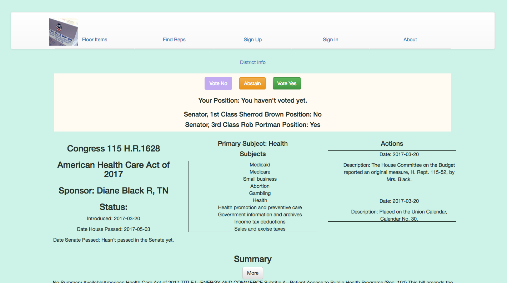

# PoktCongress

*Giving users an easy way to track their Senators' and Congress Person's voting record.*

### Users are able to vote on bills and nominations, and are given an easy to read pie chart showing how often they agree or disagree with their elected reps.

### Users can also view the items that are voted on each day in either chamber of Congress

## Technology
This project was bootstrapped using [Create React App](https://github.com/facebookincubator/create-react-app) and uses [React](https://facebook.github.io/react/), [Redux](http://redux.js.org/) and [Firebase](http://firebase.google.com/).

There is a separate [Node](https://nodejs.org) server used to communicate with external API's.

## Resources
This app gets data on congressional items from [Propublica](www.propublica.org).  
Data on congressional districts and representatives comes from [Google Civic API](https://developers.google.com/civic-information/) as well as [Geocodio](geocod.io).